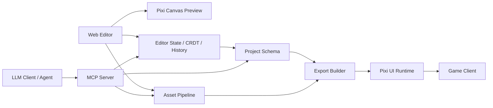

# План разработки Pixi UI Editor

## 1. Цель продукта

Pixi UI Editor - web-редактор уровня Figma/Unity Editor для создания игровых интерфейсов на PixiJS. Редактор должен позволять дизайнерам, UI-разработчикам, геймдизайнерам и LLM-агентам собирать, проверять, анимировать и экспортировать интерфейсы без ручной верстки каждого экрана.

Главная цель: сделать не "конструктор экранов", а полноценную среду производства игровых UI:

- визуальная сборка экранов и компонентов;
- точное позиционирование и layout для разных aspect ratio;
- дизайн-система, токены, стили и варианты;
- PixiJS-native preview;
- интерактивность, состояния, переходы и анимации;
- импорт ассетов и атласов;
- экспорт в runtime-формат, который игра может загрузить без редактора;
- интеграция с LLM через MCP для генерации, анализа, рефакторинга и автоматизированной сборки интерфейсов.

## 2. Продуктовые принципы

- Редактор должен быть визуальным первым, но все изменения должны иметь структурированное представление в JSON-документе.
- Runtime-вывод должен быть независимым от редактора: игра подключает легкий пакет `@pixi-ui-editor/runtime`.
- Любая операция редактора должна быть undoable/redoable.
- Любой UI-объект должен быть адресуемым, валидируемым и доступным для LLM через стабильный id/path.
- Все генеративные действия LLM должны быть прозрачными: diff, preview, apply/revert.
- Редактор должен поддерживать production-процесс: версии, инспекция, ассеты, темы, локализация, performance budgets, export pipeline.

## 3. Целевая аудитория

- UI-разработчики игр: собирают production-ready интерфейсы, экспортируют в игру.
- Дизайнеры: создают layout, компоненты, стили, варианты, состояния.
- Геймдизайнеры: настраивают тексты, состояния, награды, окна, flow.
- Технические художники: готовят ассеты, 9-slice, эффекты, адаптивность.
- LLM-агенты: создают экраны по описанию, чинят layout, рефакторят компоненты, проверяют ограничения.

## 4. Область продукта

Редактор покрывает:

- игровые HUD, popups, магазины, инвентарь, battle pass, карточки предметов, экраны результатов, настройки, onboarding;
- responsive UI под телефоны, планшеты, desktop, portrait/landscape;
- reusable components и variants;
- простые и сложные состояния: normal, hover, pressed, disabled, selected, loading, claimed, locked;
- timeline-анимации и state transitions;
- layout constraints, anchors, flex-like layout, safe areas;
- экспорт данных и ассетов для PixiJS runtime.

Редактор не должен становиться general-purpose game engine. Он отвечает за UI и связанные с ним interaction/animation/state-слои.

## 5. Высокоуровневая архитектура



Основные пакеты:

- `apps/editor` - web-приложение редактора.
- `packages/core` - типы проекта, schema, commands, validators.
- `packages/runtime` - PixiJS runtime renderer для игры.
- `packages/exporter` - сборка production bundle.
- `packages/asset-pipeline` - импорт, оптимизация, атласы, шрифты.
- `packages/mcp-server` - MCP tools/resources/prompts для LLM.
- `packages/plugin-sdk` - API расширений редактора.
- `packages/ui-kit` - собственные панели редактора.

## 6. Технологическая база

Рекомендуемый стек:

- TypeScript как основной язык.
- React для UI редактора.
- PixiJS v8 для canvas preview и runtime.
- Zustand/Jotai или Redux Toolkit для локального состояния редактора.
- Yjs/Automerge для будущей совместной работы и CRDT-документа.
- Zod/TypeBox/JSON Schema для строгих схем project document и MCP tools.
- Vite или Next.js для web-приложения.
- IndexedDB/OPFS для локальных проектов и кэша ассетов.
- Web Workers для тяжелых операций: layout, export, thumbnails, texture analysis.
- Playwright для e2e и visual regression.
- Vitest для unit/integration tests.
- Node.js MCP SDK для локального MCP-сервера.

PixiJS-основание:

- `Container` как базовый scene graph node.
- `Sprite`, `Text`, `Graphics`, `NineSliceSprite`, `TilingSprite`, custom components как leaf nodes.
- Renderer через WebGL/WebGPU auto detection.
- `generateTexture` для thumbnails, baking и export-проверок.
- Render groups/cache-as-texture для оптимизации больших UI-веток.
- `@pixi/layout` или собственная layout-обертка над Yoga-like моделью для responsive UI.

## 7. Основные сущности проекта

### 7.1 Project

Проект содержит:

- metadata: название, версия schema, авторы, дата, целевые платформы;
- pages/screens;
- component library;
- asset library;
- design tokens;
- themes;
- localization tables;
- interaction definitions;
- animation clips;
- export profiles;
- validation reports;
- editor-only metadata.

### 7.2 Scene/Page

Scene/Page - экран или отдельная композиция:

- root node;
- canvas preset: размер, orientation, safe area, background;
- device preview profiles;
- scene variables;
- linked assets;
- interaction graph;
- animation graph;
- export settings.

### 7.3 Node

Единая модель node:

- `id` - immutable UUID/ULID;
- `name` - human-readable;
- `type` - container/sprite/text/button/componentInstance/etc.;
- `parentId`;
- `children`;
- `transform`;
- `layout`;
- `style`;
- `props`;
- `states`;
- `bindings`;
- `interactions`;
- `editorMeta`.

### 7.4 Component

Component - переиспользуемый UI-шаблон:

- master definition;
- exposed properties;
- slots;
- variants;
- states;
- nested components;
- override rules;
- version history;
- migration rules.

### 7.5 Asset

Asset - управляемый ресурс:

- images: png, jpg, webp, avif;
- spritesheets/atlases;
- Spine/DragonBones/Lottie-like integrations, если нужно;
- bitmap fonts, TTF/OTF/WebFont;
- audio snippets для UI feedback;
- shader/filter presets;
- generated thumbnails;
- import metadata;
- license/source fields.

## 8. Формат документа проекта

Формат должен быть детерминированным, валидируемым и diff-friendly.

Рекомендуемая структура:

```json
{
  "schemaVersion": "1.0.0",
  "project": {
    "id": "project_01",
    "name": "Example Game UI",
    "createdAt": "2026-05-19T00:00:00.000Z"
  },
  "tokens": {},
  "themes": [],
  "assets": [],
  "components": [],
  "pages": [],
  "locales": [],
  "exportProfiles": []
}
```

Для больших проектов документ должен поддерживать split storage:

- `project.json` - index и metadata;
- `pages/*.json`;
- `components/*.json`;
- `assets/manifest.json`;
- `tokens/*.json`;
- `locales/*.json`.

В редакторе можно использовать нормализованное состояние, но на диск экспортировать стабильный формат.

## 9. Editor UI: рабочее пространство

### 9.1 Главный layout

Панели уровня Figma/Unity:

- Top bar: project switcher, save status, play/preview, export, share, LLM assistant.
- Left sidebar: pages, layers, components, assets.
- Center canvas: Pixi stage, rulers, grid, guides, selection overlay.
- Right inspector: properties, layout, style, states, interactions.
- Bottom panel: timeline, console, validation, variables, search results.
- Command palette: быстрый доступ ко всем операциям.
- Floating toolbars: transform, alignment, boolean/vector tools, text tools.

### 9.2 Canvas viewport

Возможности:

- pan/zoom;
- infinite workspace;
- artboards/device frames;
- multi-page preview;
- grid, rulers, guides;
- snapping;
- smart guides;
- safe area overlays;
- selection box;
- direct manipulation handles;
- resize/rotate/skew;
- anchor/pivot визуализация;
- node bounds vs texture bounds vs layout bounds;
- overlay hit areas;
- overlay masks/clipping;
- preview actual Pixi render and editor overlays separately.

### 9.3 Tools

Инструменты:

- Select/Move;
- Frame/Artboard;
- Container;
- Sprite/Image;
- Text;
- Shape/Graphics;
- Button;
- Input placeholder;
- ScrollView/List/Grid;
- Mask/Clip;
- Slice/9-slice editor;
- Pen/simple vector shape editor;
- Measure;
- Hand/Pan;
- Comment/annotation;
- Prototype link tool;
- Component creation tool.

### 9.4 Layers panel

Функции:

- tree hierarchy;
- drag-and-drop reorder/reparent;
- lock/hide;
- search/filter;
- solo/isolate;
- badges for component instances, broken assets, overridden props;
- z-index/sort mode;
- grouping/ungrouping;
- rename inline;
- bulk operations;
- layer color labels;
- LLM-readable path display.

### 9.5 Inspector

Разделы:

- identity: name, id, type, tags;
- transform: x, y, width, height, scale, rotation, pivot, alpha, visible;
- layout: anchors, constraints, flex/grid properties, safe area behavior;
- sprite: texture, frame, tint, blend mode, 9-slice, object fit;
- text: font, size, style, alignment, wrapping, localization key;
- graphics: fill, stroke, radius, shape;
- states: normal/hover/pressed/disabled/custom;
- interactions: events, actions, transitions;
- bindings: variables, expressions, data source;
- accessibility/debug metadata;
- performance: draw calls, texture size, cache mode warnings.

### 9.6 Assets panel

Функции:

- upload/import;
- folders/tags/search;
- preview thumbnails;
- texture atlas visualization;
- 9-slice setup;
- font preview;
- used/unused detection;
- missing asset recovery;
- replace asset globally;
- compression settings;
- density variants: 1x/2x/3x;
- sprite trimming metadata;
- export grouping.

### 9.7 Components panel

Функции:

- component library tree;
- create component from selection;
- detach instance;
- reset overrides;
- expose props;
- define slots;
- define variants;
- publish component version;
- show usages;
- component health report.

### 9.8 Timeline panel

Функции:

- animation clips per node/component/page;
- keyframes for transform/style/alpha/text/custom props;
- curves/easing editor;
- labels/events;
- nested timeline;
- preview scrubber;
- transition presets;
- state transition authoring;
- export to runtime animation graph.

### 9.9 Prototype/Flow panel

Функции:

- link buttons to screens;
- modal open/close;
- state changes;
- conditional navigation;
- simple variables;
- preview full UI flow;
- record flow as test scenario;
- export interaction graph.

### 9.10 Validation panel

Проверки:

- missing assets;
- invalid node props;
- broken component overrides;
- layout overflow;
- text overflow in locales;
- unsafe touch target size;
- unsupported filters for target platform;
- too many draw calls;
- too many large textures;
- duplicate names in critical scopes;
- unbound localization keys;
- non-deterministic export warnings.

## 10. Pixi runtime model

Runtime должен принимать экспортированный UI bundle и создавать PixiJS display tree.

### 10.1 Runtime API

Пример:

```ts
import { createPixiUiRuntime } from "@pixi-ui-editor/runtime";

const ui = await createPixiUiRuntime({
  app,
  manifestUrl: "/ui/main.manifest.json",
  locale: "ru",
  theme: "default",
});

const screen = await ui.mountScreen("shop", {
  container: app.stage,
  data: {
    coins: 1200,
    offers: []
  }
});

screen.setState("dailyReward", "claimed");
screen.updateData({ coins: 1500 });
screen.destroy();
```

### 10.2 Runtime responsibilities

- load manifest/assets/fonts;
- build Pixi display tree;
- resolve components/instances/variants;
- apply layout;
- bind text/localization/data;
- wire interactions;
- run animations/transitions;
- support responsive resize;
- expose node lookup by id/name/path;
- provide debug hooks;
- report runtime validation errors.

### 10.3 Editor-only vs runtime data

Editor-only:

- selection metadata;
- comments;
- panel state;
- guides;
- draft thumbnails;
- edit history.

Runtime:

- node tree;
- component definitions;
- asset manifest;
- layout/states/interactions/animations;
- localization/theme tokens;
- compact id map.

## 11. Layout и responsive-система

Нужны несколько режимов, потому что игровые UI часто смешивают абсолютное позиционирование и responsive constraints.

### 11.1 Layout primitives

- absolute;
- anchor to parent edges;
- center anchor;
- stretch;
- aspect ratio lock;
- min/max size;
- safe area constraints;
- flex row/column/wrap;
- grid/list layout;
- intrinsic size;
- content hug/fill;
- object fit: contain/cover/fill/none;
- scrollable container.

### 11.2 Device profiles

Профили:

- iPhone portrait;
- Android portrait;
- tablet;
- landscape phones;
- desktop canvas;
- custom game viewport;
- notched safe area;
- low-end GPU profile.

### 11.3 Responsive preview

Функции:

- переключение presets;
- side-by-side preview;
- layout diff overlay;
- text overflow per locale;
- touch target overlay;
- screenshot generation;
- snapshot comparisons.

## 12. Design system

### 12.1 Tokens

Токены:

- colors;
- gradients;
- spacing;
- radii;
- shadows/glow;
- typography;
- z-layers;
- animation durations/easings;
- sound ids;
- semantic states.

### 12.2 Themes

Темы:

- default;
- seasonal/event;
- dark/light, если нужно;
- platform-specific;
- AB-test variants.

### 12.3 Styles

Стили:

- text styles;
- fill/stroke styles;
- button styles;
- panel styles;
- icon styles;
- filter styles.

### 12.4 Variants

Компоненты должны поддерживать variants:

- size: sm/md/lg;
- intent: primary/secondary/danger;
- state: default/pressed/disabled;
- rarity: common/rare/epic/legendary;
- platform: mobile/desktop.

## 13. Interactions

### 13.1 Events

События:

- pointerdown;
- pointerup;
- pointertap;
- pointerover/pointerout;
- drag start/move/end;
- focus/blur;
- screen mounted/unmounted;
- data changed;
- state changed;
- animation completed;
- custom game event.

### 13.2 Actions

Действия:

- set state;
- set variable;
- navigate to screen;
- open/close popup;
- play animation;
- play sound;
- emit game event;
- call runtime callback;
- update data binding;
- start/stop timer;
- scroll to item.

### 13.3 Conditions

Условия:

- variable comparison;
- data binding expression;
- feature flag;
- platform/device profile;
- locale;
- component state.

### 13.4 Interaction graph

Interaction graph должен быть визуально редактируемым и сериализуемым:

- nodes: events, conditions, actions;
- edges: flow;
- reusable macros;
- validation;
- runtime trace.

## 14. Animation system

### 14.1 Keyframe animation

Поддержать:

- position;
- scale;
- rotation;
- alpha;
- tint;
- text props;
- filters;
- layout props, где безопасно;
- custom component props.

### 14.2 State transitions

Для компонентов:

- normal -> hover;
- normal -> pressed;
- locked -> unlocked;
- hidden -> visible;
- loading -> ready;
- custom gameplay states.

### 14.3 Animation runtime

Runtime API:

- `play(clipName)`;
- `stop`;
- `pause/resume`;
- `seek`;
- `setSpeed`;
- `onComplete`;
- chained animations;
- interrupt policies.

### 14.4 Presets

Нужны presets:

- fade in/out;
- pop in/out;
- slide;
- pulse;
- shake;
- counter increment;
- reward reveal;
- shimmer;
- button press bounce.

## 15. Component system

### 15.1 Component definition

Компонент включает:

- root node tree;
- props schema;
- slots;
- variants;
- states;
- interactions;
- animations;
- default data;
- exposed children.

### 15.2 Component instance

Instance хранит:

- component id/version;
- prop values;
- overrides;
- slot content;
- variant selection;
- local state;
- migration metadata.

### 15.3 Overrides

Поддержать:

- text override;
- asset override;
- style override;
- transform/layout override;
- visibility override;
- slot override;
- interaction override, если разрешено.

### 15.4 Component governance

Нужно:

- publish/unpublish;
- deprecate;
- find usages;
- update instances;
- migration scripts;
- breaking change warnings.

## 16. Text and localization

Функции:

- plain text;
- rich text subset;
- bitmap fonts;
- dynamic font loading;
- localization key binding;
- ICU-like plural forms;
- variable interpolation;
- pseudo-localization;
- per-locale overflow checks;
- fallback fonts;
- RTL readiness, если проекту понадобится;
- text auto-size/fixed-size modes.

## 17. Asset pipeline

### 17.1 Import

Поддержать:

- drag-and-drop;
- folder import;
- atlas import;
- PSD/Figma import позднее через отдельные импортеры;
- font import;
- metadata extraction;
- duplicate detection.

### 17.2 Processing

Операции:

- trim transparent pixels;
- generate mipmaps where useful;
- create spritesheet/atlas;
- convert to webp/avif/png profiles;
- density variants;
- validate max texture size;
- 9-slice editor;
- color space checks;
- thumbnail generation.

### 17.3 Export

Экспорт:

- manifest;
- optimized images;
- atlas json;
- fonts;
- content hashes;
- dependency graph;
- platform profiles.

## 18. Export pipeline

### 18.1 Export profiles

Профили:

- development;
- production;
- low-end mobile;
- high-res mobile;
- web desktop;
- test snapshot.

### 18.2 Outputs

Выходные артефакты:

- `ui.manifest.json`;
- `screens/*.json`;
- `components/*.json`;
- `tokens.json`;
- `locales/*.json`;
- `assets/*`;
- `atlas/*.json`;
- optional TypeScript types for screen/component ids;
- optional runtime preload map.

### 18.3 Type generation

Генерировать:

```ts
export type UiScreenId = "shop" | "inventory" | "battle_pass";
export type UiComponentId = "Button" | "RewardCard" | "CurrencyBadge";
export type UiLocaleKey = "shop.title" | "common.claim";
```

### 18.4 CI integration

Команды:

- `pixi-ui validate`;
- `pixi-ui export`;
- `pixi-ui diff`;
- `pixi-ui screenshot`;
- `pixi-ui lint-assets`;

## 19. Collaboration и версии

Полноценный редактор должен учитывать командную работу.

Функции:

- autosave;
- local history;
- named versions;
- branch-like drafts;
- comments;
- review mode;
- multiplayer cursors позднее;
- conflict resolution;
- changelog per page/component;
- compare versions visually and structurally.

Технически:

- сначала single-user document + history;
- затем Yjs/CRDT для real-time;
- серверная persistence модель должна быть готова к многопользовательскому режиму.

## 20. Undo/Redo и command system

Все операции должны идти через command bus.

Примеры команд:

- `createNode`;
- `deleteNode`;
- `moveNode`;
- `reparentNode`;
- `setProp`;
- `setLayout`;
- `setStyle`;
- `createComponent`;
- `detachComponent`;
- `importAsset`;
- `replaceAsset`;
- `createAnimationKeyframe`;
- `applyLLMPatch`.

Каждая команда:

- имеет input schema;
- валидирует preconditions;
- возвращает patch;
- умеет inverse patch;
- попадает в history;
- может быть сериализована для collaboration/replay.

## 21. Search, navigation, command palette

Глобальный поиск:

- pages;
- components;
- layers;
- assets;
- tokens;
- locale keys;
- commands;
- warnings;
- LLM suggestions.

Command palette:

- create screen;
- convert to component;
- select by type;
- find broken layouts;
- generate variants;
- export current screen;
- ask LLM.

## 22. Plugin system

### 22.1 Plugin types

- editor panel plugin;
- inspector section plugin;
- node type plugin;
- asset importer plugin;
- export plugin;
- validator plugin;
- runtime component plugin;
- MCP tool plugin.

### 22.2 Plugin API

Плагин получает:

- readonly project snapshot;
- command dispatcher;
- selection API;
- asset API;
- canvas overlay API;
- validation API;
- export hooks.

### 22.3 Security

- sandboxed plugin execution;
- permission manifest;
- no arbitrary filesystem access in browser;
- explicit user approval for destructive actions;
- audit log.

## 23. LLM и MCP

MCP нужен как формальный слой между LLM-клиентом и редактором. Он не должен быть "чатом поверх редактора"; он должен давать модели структурированные tools/resources/prompts для безопасной работы с UI-проектом.

### 23.1 MCP host/client/server модель

Редактор и внешние AI-приложения могут выступать MCP host. `packages/mcp-server` предоставляет MCP server, который дает доступ к проекту, assets, validators, renderer snapshots и command system.

Транспорты:

- STDIO для локального использования с IDE/desktop agent;
- Streamable HTTP для web/editor server deployment;
- WebSocket/SSE bridge внутри редактора, если host живет в браузере.

### 23.2 MCP resources

Resources должны предоставлять контекст:

- `pixi-ui://project/manifest`;
- `pixi-ui://project/schema`;
- `pixi-ui://pages`;
- `pixi-ui://pages/{pageId}`;
- `pixi-ui://components`;
- `pixi-ui://components/{componentId}`;
- `pixi-ui://assets/manifest`;
- `pixi-ui://tokens`;
- `pixi-ui://themes`;
- `pixi-ui://locales/{locale}`;
- `pixi-ui://selection`;
- `pixi-ui://validation/latest`;
- `pixi-ui://screenshots/{pageId}/{profile}`;
- `pixi-ui://runtime/api`;
- `pixi-ui://editor/capabilities`.

Resources должны быть compact-friendly:

- full read;
- summary read;
- focused read by id/path;
- dependency read for selected node/component;
- subscriptions for project changes.

### 23.3 MCP tools

Tools должны быть строго типизированы, с dry-run и diff-first режимом.

#### Project tools

- `project.get_summary`;
- `project.validate`;
- `project.apply_patch`;
- `project.create_page`;
- `project.rename_page`;
- `project.export`;
- `project.diff`;
- `project.search`.

#### Selection tools

- `selection.get`;
- `selection.set`;
- `selection.describe`;
- `selection.frame_in_canvas`;

#### Node tools

- `node.create`;
- `node.delete`;
- `node.update_props`;
- `node.move`;
- `node.reparent`;
- `node.duplicate`;
- `node.wrap_in_container`;
- `node.convert_to_component`;
- `node.find`;
- `node.get_subtree`;
- `node.apply_layout_preset`;
- `node.apply_style`;

#### Component tools

- `component.create`;
- `component.instantiate`;
- `component.update_props_schema`;
- `component.create_variant`;
- `component.find_usages`;
- `component.update_instances`;
- `component.detach_instance`;

#### Asset tools

- `asset.list`;
- `asset.import`;
- `asset.replace`;
- `asset.get_usage`;
- `asset.create_nine_slice`;
- `asset.optimize`;
- `asset.generate_placeholder`;

#### Layout tools

- `layout.analyze`;
- `layout.fix_overflow`;
- `layout.create_responsive_rules`;
- `layout.preview_profiles`;
- `layout.compare_profiles`;

#### Text/localization tools

- `locale.list_keys`;
- `locale.add_key`;
- `locale.bind_text`;
- `locale.check_overflow`;
- `locale.generate_pseudolocale`;

#### Animation tools

- `animation.create_clip`;
- `animation.add_keyframe`;
- `animation.generate_preset`;
- `animation.preview`;
- `animation.validate`;

#### Interaction tools

- `interaction.add_event`;
- `interaction.add_action`;
- `interaction.create_flow`;
- `interaction.validate`;
- `interaction.trace`;

#### Visual tools

- `render.screenshot`;
- `render.compare_snapshot`;
- `render.inspect_pixel`;
- `render.get_bounds_overlay`;
- `render.generate_thumbnail`;

#### Code/runtime tools

- `runtime.generate_integration_code`;
- `runtime.inspect_api`;
- `runtime.validate_bundle`;
- `runtime.run_preview_scenario`;

### 23.4 MCP prompts

Готовые prompt templates:

- `create_game_screen_from_brief`;
- `create_component_library`;
- `refactor_screen_to_components`;
- `fix_responsive_layout`;
- `audit_ui_accessibility`;
- `audit_performance`;
- `generate_shop_ui`;
- `generate_inventory_ui`;
- `generate_battle_pass_ui`;
- `localize_screen`;
- `create_interaction_flow`;
- `create_animation_pass`;
- `prepare_export_for_game`.

### 23.5 MCP safety model

Обязательные правила:

- destructive tools требуют confirmation или dry-run;
- любые изменения проекта возвращают patch/diff;
- LLM не получает raw secrets;
- asset import из внешних URL требует allowlist;
- tools валидируют input через JSON Schema/Zod;
- tool outputs sanitized before returning to model;
- audit log всех tool calls;
- rate limits;
- permissions: read-only, edit, export, asset-write, plugin-write.

### 23.6 LLM UX внутри редактора

AI panel:

- chat with project context;
- selected-node context;
- "apply suggestion" with visual diff;
- generated patch preview;
- before/after screenshot;
- explain current selection;
- ask to build component;
- ask to fix warning;
- ask to create variants;
- ask to create responsive behavior.

LLM actions on canvas:

- command suggestions;
- contextual quick actions;
- selection-aware edits;
- ghost preview before apply;
- inline comments/explanations.

### 23.7 LLM patch format

LLM не должен напрямую мутировать editor state. Он предлагает command patch:

```json
{
  "kind": "pixi-ui-command-patch",
  "version": "1.0",
  "commands": [
    {
      "type": "node.create",
      "args": {
        "parentId": "page_shop_root",
        "nodeType": "text",
        "name": "ShopTitle",
        "props": {
          "text": "Shop"
        }
      }
    }
  ]
}
```

Редактор:

1. валидирует команды;
2. строит preview state;
3. показывает diff;
4. рендерит before/after screenshot;
5. применяет через command bus.

## 24. Visual diff и testing

### 24.1 Snapshot system

Для каждого экрана:

- render screenshot per device profile;
- compare with baseline;
- detect pixel differences;
- attach validation warnings;
- produce report.

### 24.2 Test scenarios

Сценарии:

- open screen;
- set data;
- click button;
- wait animation;
- assert node visible;
- assert text value;
- screenshot compare.

### 24.3 Runtime tests

Проверять:

- bundle loading;
- asset resolution;
- layout consistency;
- interaction dispatch;
- animation completion;
- localization fallback;
- destroy cleanup;
- memory leaks.

## 25. Performance budgets

Редактор должен показывать production-риск до экспорта.

Метрики:

- draw calls;
- texture count;
- total texture memory;
- largest texture;
- render groups count;
- filters count;
- masks count;
- text objects count;
- layout recalculation cost;
- event listeners count;
- bundle size.

Budgets задаются per platform/profile.

## 26. Backend и storage

### 26.1 Local-first

Начальный вариант:

- IndexedDB/OPFS для проектов;
- file import/export;
- autosave;
- local snapshots.

### 26.2 Team backend

Позднее:

- auth;
- projects/workspaces;
- cloud asset storage;
- version history;
- comments;
- reviews;
- multiplayer sessions;
- export artifacts;
- CI tokens.

### 26.3 Storage schema

Сущности:

- users;
- workspaces;
- projects;
- project versions;
- documents;
- assets;
- asset variants;
- comments;
- export jobs;
- validation reports;
- audit logs.

## 27. Security

Важно:

- sanitize imported SVG/HTML-like text, если SVG вообще поддерживать;
- forbid arbitrary JS in project document;
- sandbox expression language;
- validate all external assets;
- CSP for editor;
- permission model for MCP/tools/plugins;
- audit log LLM operations;
- signed export artifacts optional;
- project schema migrations must be deterministic.

## 28. Accessibility и usability для игрового UI

Хотя Pixi UI часто canvas-only, редактор должен поддерживать metadata:

- semantic labels;
- focus order;
- minimum touch targets;
- contrast hints;
- reduced motion variants;
- controller/keyboard navigation graph;
- screen reader bridge metadata, если игра использует DOM overlay.

## 29. Импорт из Figma

Не MVP, но для полноценного продукта нужно заложить:

- import selected frames via Figma API/plugin;
- map frames to pages/components;
- map auto-layout to editor layout;
- import fills/strokes/text styles;
- import images as assets;
- detect components/variants;
- preserve names;
- produce import report;
- allow re-import/update mapping.

Ограничение: Figma import не заменяет Pixi-specific authoring. После импорта нужны 9-slice, states, interactions, performance fixes.

## 30. Интеграция с Unity-like workflow

Unity-подобные части:

- hierarchy panel;
- inspector;
- prefab-like components;
- scene preview;
- play mode;
- console;
- project assets;
- package/plugin manager;
- build/export profiles;
- runtime debug overlay.

Figma-подобные части:

- direct canvas editing;
- components/variants;
- constraints;
- auto-layout-like behavior;
- styles/tokens;
- comments;
- visual diff.

## 31. MVP vs полноценный редактор

Так как цель - полноценный редактор, MVP нужен только как первый технический milestone, а не как финальный scope.

### 31.1 Foundation milestone

- project schema;
- Pixi canvas preview;
- basic nodes: container, sprite, text, graphics;
- selection/transform;
- layers panel;
- inspector;
- command bus;
- undo/redo;
- local save/load;
- asset import;
- export minimal runtime bundle.

### 31.2 Production editor milestone

- components/instances;
- variants/states;
- layout constraints;
- responsive preview;
- validation panel;
- asset pipeline;
- runtime package;
- export profiles;
- screenshot tests.

### 31.3 Advanced authoring milestone

- interactions graph;
- timeline animation;
- localization;
- themes/tokens;
- component governance;
- command palette;
- visual diff.

### 31.4 AI/MCP milestone

- MCP server;
- resources for project/page/component/assets;
- read-only tools;
- edit tools with dry-run;
- patch preview in editor;
- LLM prompt library;
- render screenshot tool;
- validation/fix workflows.

### 31.5 Team/product milestone

- backend storage;
- version history;
- comments/review;
- multiplayer editing;
- plugin system;
- Figma import;
- CI integration;
- enterprise security.

## 32. Детальный roadmap

### Phase 0: Product/spec foundation

Deliverables:

- schema draft;
- runtime architecture;
- editor UX wireframe;
- MCP tool catalog;
- validation rules list;
- export format draft;
- sample game UI requirements.

### Phase 1: Core editor shell

Deliverables:

- React app shell;
- Pixi viewport;
- panels layout;
- project store;
- command bus;
- undo/redo;
- layers tree;
- inspector;
- basic node creation/editing.

### Phase 2: Rendering and runtime parity

Deliverables:

- editor renderer abstraction;
- runtime renderer abstraction;
- shared node-to-Pixi factory;
- asset loader;
- text/font support;
- 9-slice support;
- export/import roundtrip.

### Phase 3: Layout and responsive

Deliverables:

- anchors/constraints;
- flex/container layout;
- safe areas;
- device profiles;
- responsive preview;
- layout validation.

### Phase 4: Components and design system

Deliverables:

- node component stack: base object/container with visual and behavior components instead of rigid `sprite/text/button` leaf types;
- project format is component-first; old leaf node documents are not a compatibility target;
- built-in object components: `Fill`, `Texture`, `Text`, `Button`;
- next built-in controls: `Slider`, `Toggle`, `Input/TextInput`, `ProgressBar`, `LayoutGroup`, `FlexLayout`, `GridLayout`, `ScrollView`, `Mask`, `List/Repeater`;
- component inspector with add/remove, enable/disable, reordering, presets and per-component validation;
- editor/runtime parity for component composition, including sprite/atlas textures, text/font assets and button hit behavior;
- component creation;
- instance overrides;
- variants;
- tokens;
- themes;
- style libraries;
- component usage tracking.

### Phase 5: Interactions and animations

Deliverables:

- event/action graph;
- timeline;
- animation clips;
- state transitions;
- runtime playback;
- prototype mode.

### Phase 6: Asset pipeline and export

Deliverables:

- asset manifest;
- atlas generation;
- optimization profiles;
- type generation;
- CLI commands;
- CI validation;
- production bundle.

### Phase 7: MCP and LLM assistant

Deliverables:

- MCP server package;
- read resources;
- read-only tools;
- mutating tools with dry-run;
- patch preview UI;
- render screenshot tool;
- validation/fix tools;
- prompt templates.

### Phase 8: Collaboration and extensibility

Deliverables:

- backend persistence;
- project versions;
- comments;
- reviews;
- plugin SDK;
- Figma import;
- multiplayer prototype.

## 33. Рекомендуемый репозиторий

```text
pixi-ui-editor/
  apps/
    editor/
    docs-site/
  packages/
    core/
    runtime/
    exporter/
    asset-pipeline/
    mcp-server/
    plugin-sdk/
    ui-kit/
  examples/
    game-integration/
    sample-shop-ui/
    sample-hud/
  docs/
    architecture/
    schema/
    mcp/
    runtime/
    product/
  tests/
    fixtures/
    visual/
```

## 34. Ключевые API внутри кода

### 34.1 Core document API

```ts
export interface PixiUiProject {
  schemaVersion: string;
  project: ProjectMeta;
  tokens: TokenSet;
  themes: ThemeDefinition[];
  assets: AssetDefinition[];
  components: ComponentDefinition[];
  pages: PageDefinition[];
  locales: LocaleTable[];
  exportProfiles: ExportProfile[];
}
```

### 34.2 Command API

```ts
export interface EditorCommand<TArgs = unknown> {
  type: string;
  args: TArgs;
  meta?: {
    source?: "user" | "mcp" | "plugin" | "system";
    label?: string;
  };
}

export interface CommandResult {
  patch: ProjectPatch;
  inversePatch: ProjectPatch;
  validation: ValidationMessage[];
}
```

### 34.3 Renderer API

```ts
export interface UiRenderer {
  mountPage(pageId: string, options: MountOptions): Promise<MountedPage>;
  unmountPage(pageId: string): void;
  updateNode(nodeId: string, patch: NodePatch): void;
  resize(profile: DeviceProfile): void;
  screenshot(options: ScreenshotOptions): Promise<Blob>;
}
```

### 34.4 MCP tool contract

```ts
export interface McpEditorToolResult {
  summary: string;
  patch?: ProjectCommandPatch;
  validation?: ValidationMessage[];
  screenshots?: Array<{
    label: string;
    uri: string;
  }>;
}
```

## 35. Definition of Done

Для editor feature:

- работает через command bus;
- покрыта unit tests;
- есть undo/redo;
- валидируется schema;
- отображается в inspector/layers;
- экспортируется или явно editor-only;
- не ломает runtime roundtrip;
- имеет visual test, если влияет на rendering/layout.

Для runtime feature:

- поддерживает exported schema;
- не зависит от React/editor;
- имеет destroy cleanup;
- работает в resize;
- покрыта integration test;
- имеет пример использования.

Для MCP tool:

- input/output schema;
- dry-run, если tool мутирует проект;
- validation errors;
- audit log;
- permission tag;
- безопасный structured output;
- тест на happy path и invalid input.

## 36. Основные риски

- Слишком широкий scope без строгого schema-first подхода.
- Разъезд editor renderer и runtime renderer.
- Невалидируемые LLM-изменения.
- Перегрузка Pixi сцен большим количеством текстов/масок/фильтров.
- Сложность responsive layout для игровых UI.
- Asset pipeline может стать отдельным большим продуктом.
- Figma import может съесть много времени, если делать рано.
- Collaboration/CRDT лучше закладывать архитектурно, но не внедрять до стабилизации command model.

## 37. Приоритеты на старт

1. Зафиксировать schema и command bus.
2. Собрать Pixi preview и runtime на одном renderer factory.
3. Сделать базовые nodes, selection, transform, inspector, layers.
4. Добиться save/load/export/import roundtrip.
5. Добавить components/layout/assets validation.
6. После стабилизации core добавить MCP read tools.
7. Только затем включать mutating LLM tools с patch preview.

## 38. Источники и технические ориентиры

- PixiJS Container: https://pixijs.com/8.x/guides/components/scene-objects/container
- PixiJS Renderer: https://pixijs.com/8.x/guides/components/renderers
- PixiJS Layout: https://layout.pixijs.io/docs/guides/core/layout/
- MCP architecture: https://modelcontextprotocol.io/docs/learn/architecture
- MCP tools: https://modelcontextprotocol.io/specification/2025-06-18/server/tools
- MCP resources: https://modelcontextprotocol.io/specification/2025-06-18/server/resources
